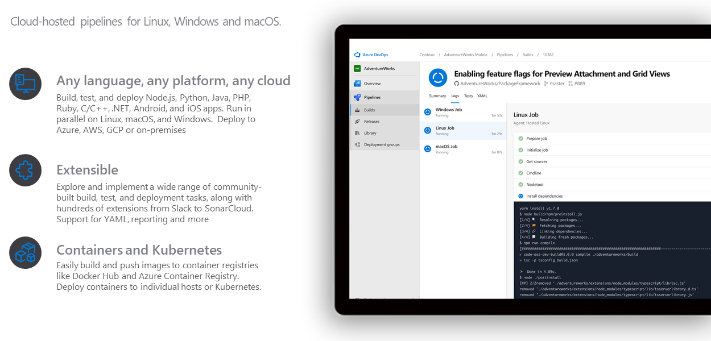
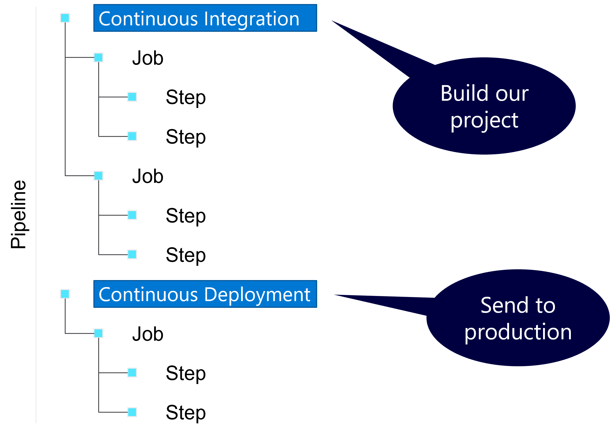
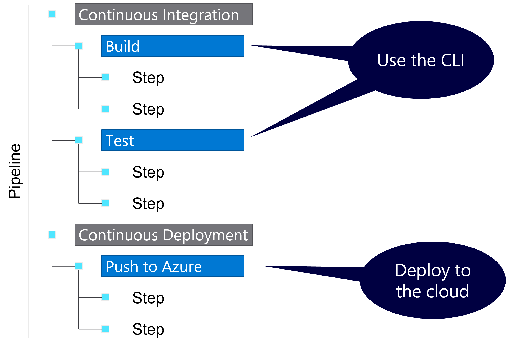
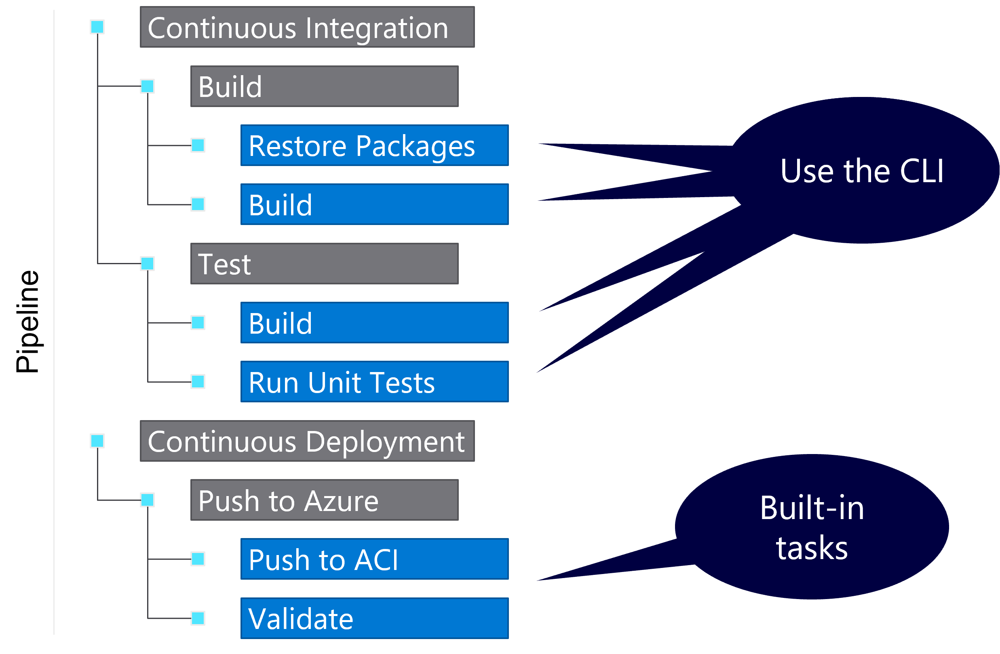
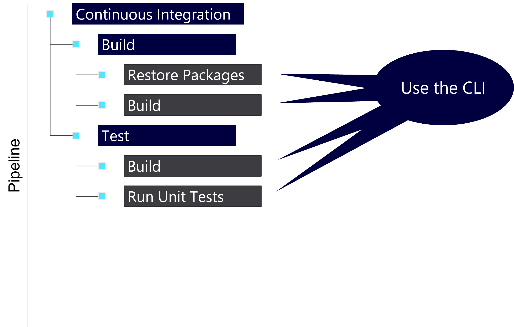
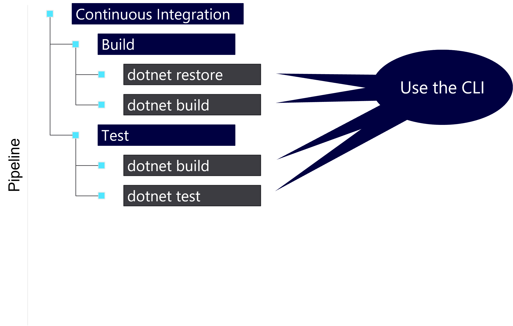

## About the presenter

Presenter Name

☁️ *Presenter Title*

> For questions or help with this series: <msusdev@microsoft.com>

All demos and source code available on **GitHub**:

> [github.com/msusdev/end-to-end-ci-cd](https://github.com/msusdev/end-to-end-ci-cd)

## Series road map

* **Session 1:**
  * **↪️ Introduction to Azure Pipelines**
* Session 2:
  * Automatically build and test your code with Azure Pipelines
* Session 3:
  * Deploy your code to Azure with Azure Pipelines

## Today's agenda

* What are **Azure Pipelines**?
* Learn the **YAML** syntax
* **Building** a simple project

::: notes

Learn how Azure Pipelines enable you to automate your software development cycle for code hosted in GitHub. We’ll walk you through using everyday actions in your first pipeline. You’ll learn how to:

* Create a pipeline
* Add actions to a pipeline
* Trigger the pipeline

:::

## Azure Pipelines



## What are Azure Pipelines?

* Packaged pipelines
* Automates common build, test, and deployment actions
* Highly configurable and extendable
* Supports an open marketplace of free and paid tools
* Includes a rich user interface system native in Azure DevOps

## Anatomy of a pipeline


## Stages



## Jobs



## Steps



## Types of steps

### Script

* Run any command-line script
* Example:
  * ``echo 'Hello World'``

### Task

* Run one of the built-in complex tasks
* Example:
  * **Publish to Azure**

## Demo: Building a project with a starter pipeline

::: notes

1. Start with an empty Azure DevOps project

1. Create a GitHub repository with a single README file

1. Use Visual Studio Code to create a new .NET console application with the following commands and code:

    ```bash
    dotnet new console
    dotnet add package Colorful.Console
    dotnet new gitignore
    dotnet new sln
    dotnet sln add <name-of-project-folder>.csproj
    ```

    ```csharp
    using static System.Drawing.Color;
    using Console = Colorful.Console;
    
    Console.WriteAscii("Hello, World!", Red);
    ```

    ```bash
    dotnet run
    ```

    > **Note**: You can use GitHub Codespaces to perform this task quickly.

1. Commit your changes to the local repository and push the changes to GitHub.

1. Return to the new Azure DevOps project.

1. Create, save, and then run a new pipeline with the following settings:

    * **Source**: GitHub
    * **Repository**: *Select GitHub repository you created earlier*
    * **Template**: .NET Desktop

1. Observe the job output logs.

:::

## Pipeline hierarchy (again...)


## Single stage pipeline


## Build and test pipeline



## Information from the developer team

| **Language** | **Install required packages** | **Run application** |
| ---: | :--- | :--- |
| **.NET** | ``dotnet restore`` | ``dotnet run`` |
| **Node.js** | ``npm install`` | ``node [file.js]`` |
| **Python** | ``pip install [package]`` | ``python [file.py]`` |
| **Ruby** | ``gem install [package]`` | ``ruby [file.rb]`` |

## .NET guidance from the developers

| &nbsp; | **.NET CLI** |
| ---: | :--- |
| **Install packages** | ``dotnet restore`` |
| **Build project** | ``dotnet build`` |
| **Run project** | ``dotnet run`` |
| **Test project** | ``dotnet test`` |
| **Publish project** | ``dotnet publish`` |

## Build and test pipeline (again...)


## Use the CLI in the pipeline



## Start with your stages keyword

```yml
stages:
```

## Then, the stages array

```yml
stages:
- stage: <name_of_stage>
- stage: <name_of_stage>
```

## Name each stage

```yml
stages:
- stage: continuous_integration
```

## Next, the jobs keyword

```yml
stages:
- stage: continuous_integration
  jobs:
```

## Then add jobs

```yml
stages:
- stage: continuous_integration
  jobs:
  - job: <job_name>
  - job: <job_name>
```

## Now, name each job

```yml
stages:
- stage: continuous_integration
  jobs:
  - job: build
```

## Finally, add the steps keyword to the job

```yml
stages:
- stage: continuous_integration
  jobs:
  - job: build
    steps:
```

## Reviewing, the types of steps

### Script

* Run any command-line script
* Example:
  * ``dotnet build``

### Task

* Run one of the built-in complex tasks
* Example:
  * **Create an Artifact**

## Steps can be scripts or tasks

```yml
stages:
- stage: continuous_integration
  jobs:
  - job: build
    steps:
    - script: <some_script_to_execute>
    - task: <name_of_builtin_task>
```

## Remembering the word from the developers

### Restore .NET packages from NuGet

```bash
dotnet restore
```

### Build .NET project

```bash
dotnet build
```

## Build and restore a .NET project

```yml
stages:
- stage: continuous_integration
  jobs:
  - job: build
    steps:
    - script: dotnet restore
    - script: dotnet build
```

## Demo: Building a .NET project using a pipeline

::: notes

1. Return to the GitHub project.

1. Remove every file in the project except for the following three files:

    * **\<name-of-project-folder\>.csproj**
    * **Program.cs**
    * **.gitignore**

1. Create a new pipeline YAML file in your project.

    > **Note**: The filename of the pipeline is arbitrary. For the remainder of the demos, we will assume you named the pipeline **pipeline.yml**.

1. Add the following content to the pipeline YAML file:

    ```yml
    stages:
    - stage: continuous_integration
      jobs:
      - job: build
        steps:
        - script: dotnet restore
        - script: dotnet build
    ```

1. Commit your changes to the local repository and push the changes to GitHub.

1. Return to the Azure DevOps project.

1. Create, save, and then run a new pipeline with the following settings:

    * **Source**: GitHub
    * **Repository**: *Select GitHub repository you created earlier*
    * **Template**: Existing Azure Pipelines YAML file
    * **Branch**: *main*
    * **Path**: */pipeline.yml*

1. Observe the job output logs.

1. Update the content of the pipeline YAML file:

    ```yml
    stages:
    - stage: continuous_integration
      jobs:
      - job: build
        steps:
        - script: dotnet --version
        - script: dotnet restore
        - script: dotnet build
        - script: dotnet run
    ```

1. Commit your changes to the local repository and push the changes to GitHub.

1. Return to the Azure DevOps project and your new pipeline.

1. Observe the job output logs for the latest automated run.

:::

## Hard-coded names

| **Task** | **Name** |
| ---: | :--- |
| **Single Stage** | continuous_integration |
| **Single Job** | build |
| **Script (``dotnet restore``)** | CmdLine |
| **Script (``dotnet build``)** | CmdLine |

## Implementing display names

```yml
stages:
- stage: continuous_integration
  displayName: Continuous Integration
  jobs:
  - job: build
    displayName: Build
    steps:
    - script: dotnet restore
      displayName: Restore NuGet packages
```

## Demo: Creating friendly names

::: notes

1. Return to the GitHub project.

1. Update the content of the pipeline YAML file:

    ```yml
    stages:
    - stage: continuous_integration
      displayName: Continuous Integration
      jobs:
      - job: build
        displayName: Build
        steps:
        - script: dotnet --version
          displayName: Check .NET SDK version
        - script: dotnet restore
          displayName: Restore NuGet packages
        - script: dotnet build
          displayName: Build .NET project
        - script: dotnet run
          displayName: Run .NET application
    ```

1. Commit your changes to the local repository and push the changes to GitHub.

1. Return to the Azure DevOps project and your pipeline.

1. Observe the job output logs for the latest automated run.

:::

## Microsoft-hosted agents

| **Image** | **Specification** |
| ---: | :--- |
| **Windows Server 2022 & Visual Studio 2022** | ``windows-2022`` |
| **Windows Server 2019 & Visual Studio 2019** | ``windows-latest`` *or* ``windows-2019`` |
| **Ubuntu 20.04** | ``ubuntu-latest`` *or* ``ubuntu-20.04`` |
| **Ubuntu 18.04** | ``ubuntu-18.04`` |
| **macOS 11 Big Sur** | ``macOS-latest`` *or* ``macOS-11`` |
| **macOS X Catalina 10.15** | ``macOS-10.15`` |

## Included software examples (``ubuntu-latest``)

* Ansible
* Azure CLI
* Docker
* .NET SDK
* Git
* Helm
* Node.js
* Terraform
* Python

## Specifying a *pipeline* agent pool

```yml
pool:
  vmImage: ubuntu-latest
stages:
- stage: continuous_integration
  jobs:
  - job: build
    steps:
    - script: dotnet build
      displayName: Build .NET project
```

## Specifying a *job* container

```yml
pool:
  vmImage: ubuntu-latest
stages:
- stage: continuous_integration
  jobs:
  - job: build
    container: mcr.microsoft.com/dotnet/sdk:latest
    steps:
    - script: dotnet build
```

## Demo: Switching to a .NET 6 container

::: notes

1. Return to the GitHub project.

1. Update the content of the pipeline YAML file:

    ```yml
    pool:
      vmImage: ubuntu-20.04    
    stages:
    - stage: continuous_integration
      displayName: Continuous Integration
      jobs:
      - job: build
        displayName: Build
        container: mcr.microsoft.com/dotnet/sdk:6.0
        steps:
        - script: dotnet --version
          displayName: Check .NET SDK version
        - script: dotnet restore
          displayName: Restore NuGet packages
        - script: dotnet build
          displayName: Build .NET project
        - script: dotnet run
          displayName: Run .NET application
    ```

1. Commit your changes to the local repository and push the changes to GitHub.

1. Return to the Azure DevOps project and your pipeline.

1. Observe the job output logs for the latest automated run.

:::

## Reviewing today's session

* Azure Pipelines
* YAML syntax
* Building projects

## Reference Links

* <https://azure.com/pipelines>
* <https://docs.microsoft.com/azure/devops/pipelines/yaml-schema>
* <https://github.com/features/codespaces>

## Microsoft Learn

* <https://docs.microsoft.com/learn/paths/build-applications-with-azure-devops/>

## Thank You! Questions?
