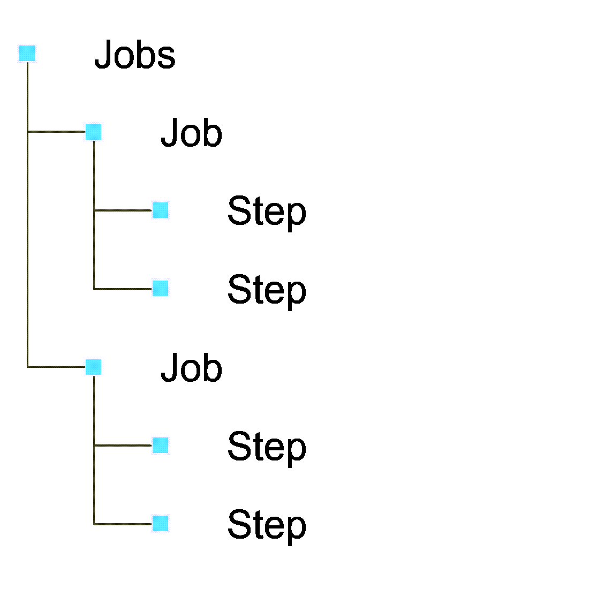
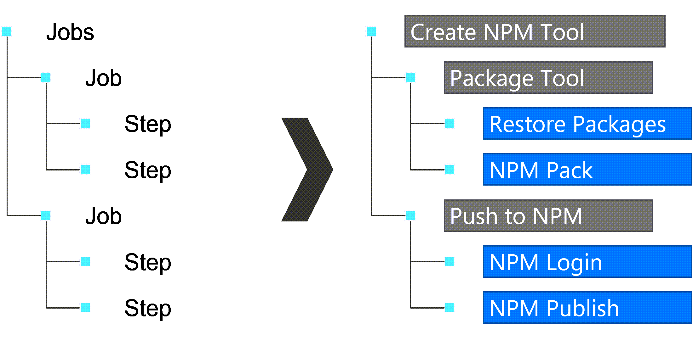

## About the presenter

Presenter Name

☁️ *Presenter Title*

> For questions or help with this series: <msusdev@microsoft.com>

All demos and source code available on **GitHub**:

> [github.com/msusdev/end-to-end-ci-cd](https://github.com/msusdev/end-to-end-ci-cd)

## Series road map

* **Session 1:**
  * **↪️ Introduction to GitHub Actions**
* Session 2:
  * Automatically build and test your code with GitHub Actions
* Session 3:
  * Deploy your code to Azure with GitHub Actions

## Today's agenda

* What are **GitHub Actions**?
* Learn the **YAML** syntax
* **Building** a simple project

::: notes

Learn how GitHub Actions enable you to automate your software development cycle for code hosted in GitHub. We’ll walk you through using everyday actions in your first workflow. You’ll learn how to:

* Create a workflow
* Add actions to a workflow
* Trigger the workflow

:::

## What are GitHub Actions?

* Packaged workflows
* Automates common build, test, and deployment actions
* Highly configurable and extendable
* Supports an open marketplace of free and paid tools
* Includes a rich user interface system native in GitHub

## Anatomy of a workflow



## Example of a workflow



## Demo: Configuring a workflow to check the build environment

::: notes

1. Start with an empty GitHub repository

1. Create a **.github/workflows/build.yml** file

    > **Note**: The name of this file is arbitrary. For the remainder of this demo, we will assume you named this file **build.yml**.

1. In the **build.yml** file, add and validate:

    ```yml
    on: push
    ```

1. Add and validate:

    ```yml
    on: push
    jobs:
      first-job:
    ```

1. Add and validate:

    ```yml
    on: push
    jobs:
      first-job:
        steps:
          - run: node --version
          - run: npm --version
    ```

1. Add and validate:

    ```yml
    on: push
    jobs:
      first-job:
        runs-on: windows-latest
        steps:
          - run: node --version
          - run: npm --version
    ```

:::

## Configuring the workflow environment

* **Trigger**
  * Uses the ``on`` keyword
  * Specifies the triggering event (ex. ``push``, ``pull_request``)
  * Filters to **specific** branches or **tags**
* **Environment *(optional)***
  * Uses the ``env`` keyword
  * Configures environment variables

## Configuring the job-specific workflow environment

* **Runs on**
  * Uses the ``jobs.runs-on`` keyword
  * Chooses between a GitHub or self-hosted runner
  * For **GitHub-hosted** runners, specifies an operating system (ex. ``windows-2019``, ``macos-11``, ``ubuntu-20.04``)
* **Container *(optional)***
  * Uses the ``jobs.container`` keyword
  * Chooses a container, from Docker Hub, to use as the workflow environment
  * Hosted on the machine specified in ``jobs.runs-on``

## Demo: Customizing the workflow environment

::: notes

1. In the **.github/workflows/build.yml** file, add and validate:

    ```yml
    on: push
    jobs:
      first-job:
        runs-on: ubuntu-latest
        steps:
          - run: node --version
          - run: npm --version
    ```

1. Add and validate:

    ```yml
    on: push
    jobs:
      first-job:
        runs-on: ubuntu-latest
        container: node:17.6.0
        steps:
          - run: node --version
          - run: npm --version
    ```

1. Add and validate:

    ```yml
    on: push
    jobs:
      first-job:
        runs-on: ubuntu-latest
        container: node:14
        steps:
          - run: node --version
          - run: npm --version
    ```

1. Add and validate:

    ```yml
    name: Node Continuous Integration
    on: push
    jobs:
      build-node:
        name: Build Node
        runs-on: ubuntu-latest
        container: node:14
        steps:
          - run: node --version
          - run: npm --version
    ```

1. Add and validate:

    > *Warning*: This step won't work as expected since there's nothing to "install" from NPM due to a missing **package.json** file

    ```yml
    name: Node Continuous Integration
    on: push
    jobs:
      build-node:
        name: Build Node
        runs-on: ubuntu-latest
        container: node:14
        steps:
          - run: node --version
          - run: npm --version
          - run: npm install
    ```

:::

## Sourcing GitHub Actions

[github.com/marketplace](https://github.com/marketplace?type=actions)

* Any action can be created in a GitHub repository and surfaced through the marketplace as a paid or free action
* Actions are referenced using the typical **org-name/repo-name** syntax

## Example: Checkout action

[github.com/actions/checkout](https://github.com/actions/checkout)

> *Checks-out the code in the current repository for use in the workflow*

* **Actions** organization
* **Checkout** repository
* Latest version is **V2**

## Using marketplace actions in a workflow

* Reference action using the ``uses`` keyword
* Optionally, configure action properties using the ``with`` keyword

  ```yml
  - uses: org-name/repo-name@v0
    with:
      property: value    
  ```

## Example: Using Checkout action

```yml
- uses: actions/checkout@v2
```

## Example: Upload Build Artifact action

[github.com/actions/upload-artifact](https://github.com/actions/upload-artifact)

> *Uploads build artifacts from the workflow to access after the workflow is complete*

* **Actions** organization
* **Upload-Artifact** repository
* Latest version is **V2**

## Example: Using Upload Build Artifact action

```yml
- uses: actions/upload-artifact@v2
  with:
    name: my-artifact
    path: path/to/artifact/
```

## Demo: Node Continuous Integration

::: notes

1. Create a simple node project:

    ```javascript
    console.log('Hello, world!');
    ```

    ```
    node_modules/
    package-lock.json
    ```

    ```json
    {
      "name": "simple",
      "main": "app.js"
    }
    ```

1. In the **.github/workflows/build.yml** file, add and validate:

    ```yml
    name: Node Continuous Integration
    on: push
    jobs:
      build-node:
        name: Build Node
        runs-on: ubuntu-latest
        container: node:14
        steps:
          - run: node --version
          - run: npm --version
          - uses: actions/checkout@v2
          - run: dir
    ```

1. Add and validate:

    ```yml
    name: Node Continuous Integration
    on: push
    jobs:
      build-node:
        name: Build Node
        runs-on: ubuntu-latest
        container: node:14
        steps:
          - run: node --version
          - run: npm --version
          - uses: actions/checkout@v2
          - run: npm install
    ```

1. Add and validate:

    ```yml
    name: Node Continuous Integration
    on: push
    jobs:
      build-node:
        name: Build Node
        runs-on: ubuntu-latest
        container: node:14
        steps:
          - run: node --version
          - run: npm --version
          - uses: actions/checkout@v2
          - run: npm install
          - run: node app.js
    ```

1. Review workflow output

1. Add and validate:

    ```yml
    name: Node Continuous Integration
    on: push
    jobs:
      build-node:
        name: Build Node
        runs-on: ubuntu-latest
        container: node:14
        steps:
          - run: node --version
            name: Check Node Version
          - run: npm --version
            name: Check NPM Version
          - uses: actions/checkout@v2
            name: Checkout Code
          - run: npm install
            name: Install NPM Packages
          - run: node app.js
            name: Run Application
    ```

1. Update Node project:

    ```bash
    npm install --save moment
    ```

    ```javascript
    console.log('Hello, world!');
    
    var moment = require('moment');
    var date = moment().format('LL');
    console.log(date);
    ```

1. Review workflow output after project has been updated

:::

## Reviewing today's session

* GitHub Actions
* YAML syntax
* Building projects

## Reference Links

* <https://docs.github.com/actions/learn-github-actions/introduction-to-github-actions#understanding-the-workflow-file>
* <https://hub.docker.com/_/node>
* <https://github.com/actions/checkout>

## Microsoft Learn

* <https://docs.microsoft.com/learn/paths/automate-workflow-github-actions/>

## Thank You! Questions?
